# CEBU INSTITUTE OF TECHNOLOGY
# UNIVERSITY

## COLLEGE OF COMPUTER STUDIES

## Software Design Description
## for
## VoxSight

---

## Change History Signature

| Version | Description     | Date Completed |
|---------|-----------------|----------------|
| 0.1     | Initial Release | May 12, 2026   |

---

## Preface

**Project Background.**
VoxSight was conceived to address a common challenge in choral music: the steep learning curve amateur singers face when transitioning from a physical sheet of music to an accurate vocal performance. Traditional practice methods often lack immediate, objective feedback, leading to the reinforcement of pitch errors. VoxSight bridges this gap by transforming static scores into interactive, data-driven practice sessions.

**Intent of this Document.**
This Software Design Description (SDD) serves as the definitive technical roadmap for the VoxSight mobile application. It is intended to guide the development team through the implementation of complex signal processing, UI synchronization, and OMR (Optical Music Recognition) integration.

**Intended Audience:**
- **Software Developers:** For implementing the Kotlin/Android and Python/FastAPI components.
- **System Architects:** To verify the integration between the mobile client and the OMR engine.
- **Quality Assurance (QA) Teams:** To derive test cases based on the defined technical constraints (e.g., the ±10 cents pitch tolerance and <100ms latency).

**Document Organization:**
- Module 1: The digitization of physical scores via OMR.
- Module 2: The synthesis and selective isolation of SATB vocal parts.
- Module 3: The synchronization of the visual playhead with the audio clock.
- Module 4: The real-time frequency analysis and pitch feedback loop.

---

## Table of Contents

- Change History Signature
- Preface
- Table of Contents
- Introduction
  - 1.1. Purpose
  - 1.2. Scope
  - 1.3. Definitions and Acronyms
    - Acronyms
    - Definitions
  - 1.4. References
- Architectural Design
- Detailed Design
  - Module 1.
    - 1.1 Transaction name: Upload Sheet Music
    - 1.2 Transaction name: Process Score via OMR Engine.
    - 1.3 Transaction name: Generate MusicXML & Separate SATB Parts.
  - Module 2.
    - 2.1: Select Voice Part and Apply Focus
    - 2.2: Play Assigned Part ( Synthesized Vocal Tune )
    - 2.3: Toggle Audio Suppression / Visual Focus
  - Module 3.
    - 3.1: Initiate Playback with Tracking
    - 3.2 Transaction Name: Pause and Resume Tracking
  - Module 4.
    - 4.1 Transaction Name: Sight-Reading Training

---

## Introduction

### 1.1. Purpose

The purpose of this Software Design Description (SDD) is to detail the architectural and component-level design of the VoxSight mobile application. This document translates the requirements established in the VoxSight Software Requirements Specification (SRS) into a concrete technical blueprint. It serves as the primary technical reference for the development team to implement the system's front-end interfaces, back-end logic, and data structures.

### 1.2. Scope

This document covers the architectural and detailed design of VoxSight, an Android-based mobile application designed for amateur choir members. The design encompasses the client-side mobile application, the server-side API routing, integration with a third-party Optical Music Recognition (OMR) engine, and local data persistence mechanisms. It details the technical implementation for the four core modules: Controlled OMR Digitization, Audio-Visual Selective Focus, Dynamic Score Tracking, and Real-Time Pitch Feedback.

### 1.3. Definitions and Acronyms

#### Acronyms

- **API** — Application Programming Interface
- **ERD** — Entity Relationship Diagram
- **Hz** — Hertz (Unit of frequency)
- **MIDI** — Musical Instrument Digital Interface
- **MusicXML** — Music Extensible Markup Language
- **OMR** — Optical Music Recognition
- **PK / FK** — Primary Key / Foreign Key
- **SATB** — Soprano, Alto, Tenor, Bass (the four standard voice parts)
- **SDD** — Software Design Description
- **SRS** — Software Requirements Specification
- **TLS** — Transport Layer Security
- **UI / UX** — User Interface / User Experience
- **UUID** — Universally Unique Identifier

#### Definitions

- **Cents** — A logarithmic unit of measure used for musical intervals. In this system, 100 cents equal one semitone. VoxSight uses a ±10 cents tolerance for pitch matching.
- **Deskewing** — A pre-processing technique used by the OMR engine to straighten images of sheet music captured at an angle, ensuring accurate staff line detection.
- **Digitization** — The process of converting physical or image-based sheet music into a machine-readable format (MusicXML) containing metadata for pitch, duration, and rhythm.
- **NoteEvent** — A specific data object representing a musical note. It contains the MIDI value, start time in milliseconds relative to the beginning of the score, and the assigned SATB voice part.
- **Pitch Detection Engine** — A back-end component that uses frequency analysis methods, such as Fast Fourier Transform (FFT) or autocorrelation, to identify the fundamental frequency of a user's vocal input.
- **Playhead** — A visual vertical line that moves across the digital score during playback to indicate the current temporal position in the music.
- **Scoped Storage** — An Android security feature that restricts an application's access to the device's file system, requiring the use of designated folders for saving MusicXML and media files.
- **Sync Drift** — The discrepancy in timing between the audio clock (what the user hears) and the UI render clock (what the user sees). VoxSight aims to keep this drift below 100 milliseconds.
- **Target Note** — The specific pitch, measured in Hz, that a user is expected to sing at a given timestamp in the score. It serves as the benchmark for real-time vocal feedback.

### 1.4. References

[1] E. O. Lagamo Jr., T. D. Castillo Jr., D. D. L. Sala, J. E. S. Sevilla, and G. O. E. Velasco, "Software Requirements Specification for VoxSight," College of Computer Studies, Cebu Institute of Technology - University, Cebu City, Philippines, Unpublished, 2026.

[2] BreezeWhite, "oemer: End-to-end Optical Music Recognition," GitHub repository, 2023. [Online]. Available: https://github.com/BreezeWhite/oemer. [Accessed: May 2026].

[3] W3C Music Notation Community Group, "MusicXML 4.0 Specification," W3C, Jun. 2021. [Online]. Available: https://www.w3.org/2021/06/musicxml40/. [Accessed: May 2026].

[4] J. Six, "TarsosDSP: A Real-Time Audio Processing Framework in Java," Ghent University. [Online]. Available: https://0110.be/releases/TarsosDSP/. [Accessed: May 2026].

[5] Google, "Jetpack Compose Documentation," Android Developers. [Online]. Available: https://developer.android.com/jetpack/compose. [Accessed: May 2026].

[6] S. Ramírez, "FastAPI," Tiangolo. [Online]. Available: https://fastapi.tiangolo.com/. [Accessed: May 2026].

[7] Supabase, "Supabase Architecture and API Reference," Supabase Inc. [Online]. Available: https://supabase.com/docs. [Accessed: May 2026].

---

## Architectural Design

**VoxSight, Block Diagram.**

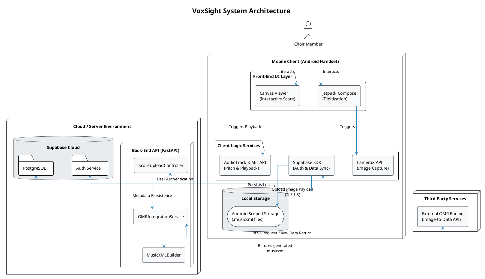

---

## Detailed Design

## Module 1.

### 1.1 Transaction name: Upload Sheet Music

**User Interface Design.**

**Front-end component(s):**

- **Component Name:** UploadScoreScreen
  - **Description and purpose:** Provides the UI buttons for "Take Photo" and "Import from Device", and handles the Android device permission requests.
  - **Component type or format:** Jetpack Compose UI (Kotlin)

- **Component Name:** ImageCaptureService
  - **Description and purpose:** Interfaces with the device camera to capture the image and performs basic resolution/clarity validation.
  - **Component type or format:** Native Android CameraX API

**Back-end component(s):**

- **Component Name:** ScoreUploadController
  - **Description and purpose:** Receives the multipart image payload via secure TLS 1.3 connection and validates the file format.
  - **Component type or format:** FastAPI Router Endpoint (Python)

**Object-Oriented Components:**

Class Diagram: (Note: This unified class diagram represents all core objects utilized across Module 1's transactions).

**Data Design:**

ERD or schema: N/A (Data is strictly in transit during this transaction; no database persistence occurs until Transaction 1.3).

**Transaction 1.1, Class Diagram.**

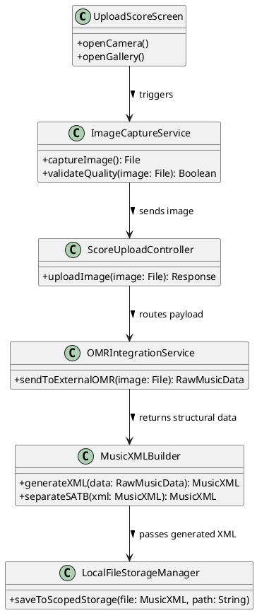

**Transaction 1.1, Sequence Diagram:** (Focuses specifically on the UI capture and API upload phase).

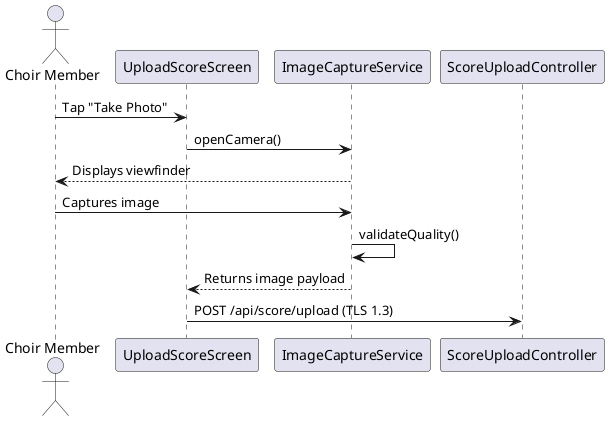

---

### 1.2 Transaction name: Process Score via OMR Engine.

**User Interface Design.**

**Front-end component(s):**

- **Component Name:** ProcessingLoadingState
  - **Description and purpose:** A visual progress indicator shown to the user while the server processes the image.
  - **Component type or format:** Jetpack Compose Dialog / Overlay (Kotlin)

**Back-end component(s):**

- **Component Name:** OMRIntegrationService
  - **Description and purpose:** Securely routes the image payload to the external OMR Engine, handles deskewing/noise reduction, and awaits the structural data return. If score recognition fails or confidence levels fall below acceptable thresholds, the service returns an error response prompting the user to recapture or upload a clearer image.
  - **Component type or format:** FastAPI Asynchronous Service (Python)

**Object-Oriented Components:**

Class Diagram: (Refer to unified Module 1 Class Diagram in Section 1.1).

Sequence Diagram: (Focuses on the server-side OMR processing block).

**Data Design:**

ERD or schema: N/A (Data is being actively processed in memory; no database persistence).

**Transaction 1.2, Sequence Diagram.**

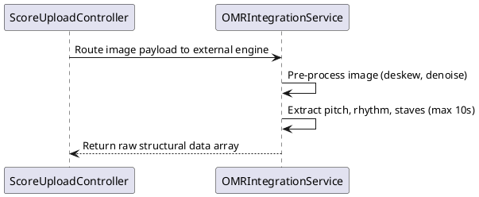

---

### 1.3 Transaction name: Generate MusicXML & Separate SATB Parts.

**User Interface Design.**

UI Note: Upon successful generation of the MusicXML file, the UI dismisses the loading state, updates the Recent Scores list, and provides a standard Android success toast.

**Front-end component(s):**

- **Component Name:** LocalFileStorageManager
  - **Description and purpose:** Downloads the compiled MusicXML file from the server, saves it to Android Scoped Storage, and syncs metadata with Supabase.
  - **Component type or format:** Kotlin Coroutine / File I/O Utility (with Supabase SDK)

**Back-end component(s):**

- **Component Name:** MusicXMLBuilder
  - **Description and purpose:** Maps the raw pitch/rhythm data returned by the OMR engine into a strict MusicXML schema, ensuring SATB vocal parts are structurally separated whenever identifiable from the processed score.
  - **Component type or format:** Python XML Serialization Utility

**Object-Oriented Components:**

Class Diagram: (Refer to unified Module 1 Class Diagram in Section 1.1).

Sequence Diagram: (Focuses on the XML generation and local saving phase).

**Data Design:**

ERD or schema.

**Transaction 1.3, Sequence Diagram.**

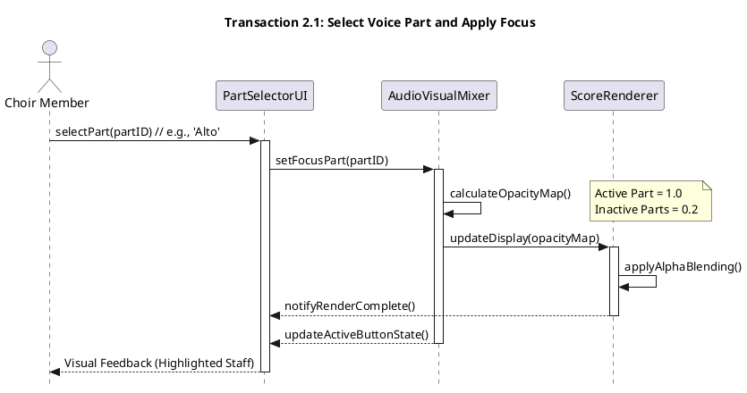

**Transaction 1.3, Class Diagram.**

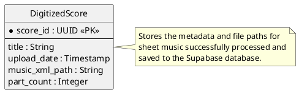

---

## Module 2.

### 2.1: Select Voice Part and Apply Focus

**User Interface Design.**

**Front-end Component(s):**

- **Component Name:** PartSelectorUI
  - **Description and Purpose:** Provides the interactive buttons (S, A, T, B). It captures the user's touch event and notifies the mixer which part is now "Active."
  - **Component Type or Format:** Jetpack Compose UI (Kotlin).

- **Component Name:** AudioVisualMixer
  - **Description and Purpose:** The central logic controller for Module 2. It calculates the opacity values (100% for active, 20% for inactive) and passes these instructions to the renderer.
  - **Component Type or Format:** Kotlin ViewModel / Controller Class.

- **Component Name:** ScoreRenderer
  - **Description and Purpose:** The engine that draws the MusicXML onto the screen. It applies the "Alpha Blending" (dimming effect) to the staves based on the Mixer's calculations.
  - **Component Type or Format:** Jetpack Compose Canvas API.

**Object-Oriented Components:**

Sequence Diagram.

**Transaction 2.1, Sequence Diagram.**

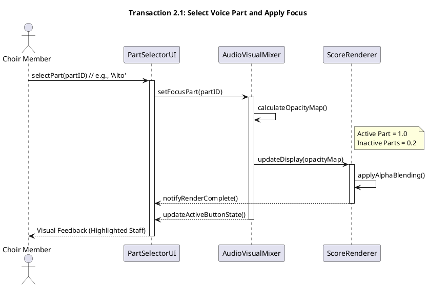

---

### 2.2: Play Assigned Part ( Synthesized Vocal Tune )

**User Interface Design.**

**Front-end Component(s):**

- **Component Name:** AudioSynthesisEngine
  - **Description and Purpose:** Parse the pitch and duration data from the MusicXML. It maps these to bundled human 'Aahs/Oohs' soundfonts and ensures a maximum frequency deviation of ±10 cents.
  - **Component Type or Format:** Native Android Audio Bridge (C++ / Kotlin).

- **Component Name:** PlaybackController
  - **Description and Purpose:** Manages the play, pause, and stop states. It ensures that as the music plays, the "Highlighter" on the screen remains synchronized with the audio within the acceptable latency threshold.
  - **Component Type or Format:** Kotlin StateFlow / Coroutine Controller.

**Back-end Component(s):**

- **Component Name:** LocalScopedStorage
  - **Description and Purpose:** The secure local directory where the app stores processed scores. This avoids the need to download the file every time the user practices.
  - **Component Type or Format:** Android Scoped Storage API.

**Object-Oriented Components:**

Sequence Diagram.

**Transaction 2.2, Sequence Diagram.**

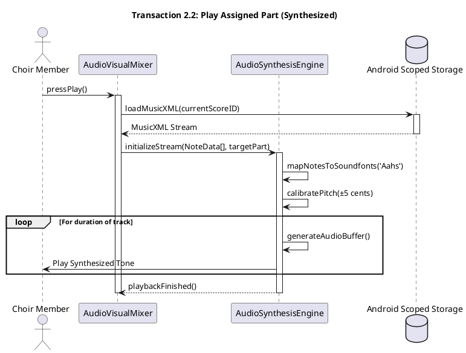

---

### 2.3: Toggle Audio Suppression / Visual Focus

**User Interface Design.**

**Front-end Component(s):**

- **Component Name:** FocusToggleSwitch
  - **Description and Purpose:** A UI toggle that allows the user to turn off the isolation. If turned OFF, it forces the AudioVisualMixer to set all staves and all audio tracks to 100%.
  - **Component Type or Format:** Jetpack Compose Switch Widget.

- **Component Name:** GlobalStateMonitor
  - **Description and Purpose:** Tracks whether the user is currently in "Isolated Practice" or "Full Choir" mode. It broadcasts this state to all other Module 2 components.
  - **Component Type or Format:** Kotlin ViewModel / StateFlow.

**Back-end Component(s):**

- **Component Name:** UserPreferencesStore
  - **Description and Purpose:** Persists the user's choice. If a user prefers to always start in "Isolation Mode," this component saves that setting to the database.
  - **Component Type or Format:** Supabase Database (Remote) / Android Jetpack DataStore (Local).

**Object-Oriented Components:**

Sequence Diagram.

**Transaction 2.3, Sequence Diagram.**

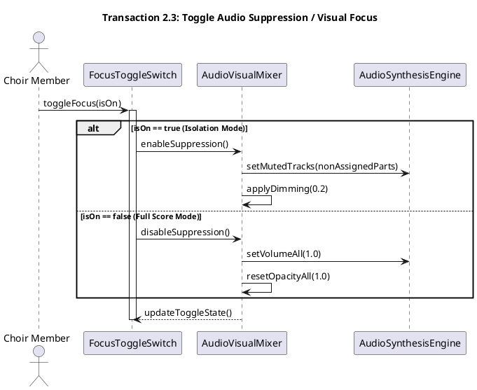

---

## Module 3.

### 3.1: Initiate Playback with Tracking

**User Interface Design.**

The Initiate Playback with Tracking interface is part of the unified Interactive Practice Screen. It presents the digitized sheet music in a scrollable score viewer and overlays a real-time playhead that advances in sync with audio playback. The screen provides Play/Pause transport controls and auto-scrolls to keep the active measure centered on screen at all times.

**Front-end component(s):**

- **Component Name:** ScoreRenderer
  - **Description and purpose:** The primary canvas that draws the sheet music on the screen, managing the auto-scrolling to keep the active measure centered.
  - **Component type or format:** Jetpack Compose Canvas API.

- **Component Name:** PlayheadSynchronizer
  - **Description and purpose:** Reads the internal audio clock and updates the vertical playhead position (highlighting active notes) targeting synchronization drift below 100 milliseconds during playback.
  - **Component type or format:** Timing Synchronization Class.

- **Component Name:** PlaybackControlBar
  - **Description and purpose:** Provides the Play and Pause transport buttons. Displays a measure/beat progress indicator so the user can track their position in the score at a glance.
  - **Component type or format:** Jetpack Compose Stateful Component; dispatches play and pause commands to the back-end PlaybackEngineService.

- **Component Name:** AutoScrollController
  - **Description and purpose:** Monitors the current playhead position emitted by PlayheadSynchronizer and programmatically scrolls the ScoreRenderer to keep the active measure centered in the viewport during continuous playback.
  - **Component type or format:** Kotlin Coroutine / ScrollState Observer; subscribes to playhead position events and calls the scroll API of the ScoreRenderer.

**Back-end component(s):**

- **Component Name:** MusicXMLParser
  - **Description and purpose:** Reads the locally stored MusicXML file and produces an ordered in-memory list of NoteEvent objects, each carrying pitch, start timestamp, duration, and SATB voice assignment. This list serves as the primary playback reference consumed by the PlaybackEngineService and Module 4's Pitch Comparison Engine.
  - **Component type or format:** Kotlin utility class using Android's built-in XML pull parser; outputs List\<NoteEvent\>.

- **Component Name:** PlaybackEngineService
  - **Description and purpose:** Manages the internal audio clock. Schedules note-start events from the NoteEvent queue, passes audio data to the synthesizer (Module 2), and emits highlight-update callbacks to the front-end PlayheadSynchronizer. Re-syncs the playhead automatically if render-to-audio drift exceeds 0.1 seconds.
  - **Component type or format:** Android background Service (Kotlin); uses android.media.AudioTrack for low-latency audio scheduling and a Handler/Runnable loop for note-event dispatch.

- **Component Name:** SyncDriftMonitor
  - **Description and purpose:** Continuously compares the rendered playhead timestamp against the audio clock. If the delta exceeds 100 ms, it triggers a forced re-sync to bring the highlight back into alignment with the audio.
  - **Component type or format:** Kotlin coroutine / Flow observer running within the PlaybackEngineService lifecycle.

**Object-Oriented Components:**

- Class Diagram
- Sequence Diagram

**Data Design:**

- ERD

**Transaction 3.1, Class Diagram.**

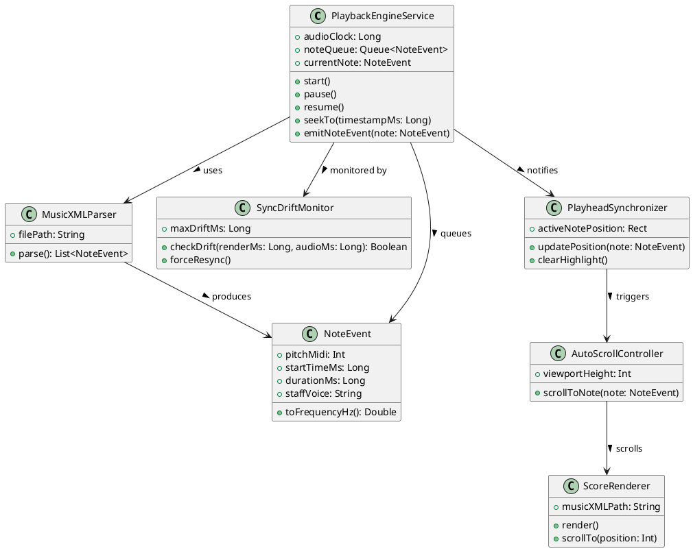

**Transaction 3.2, Sequence Diagram.**

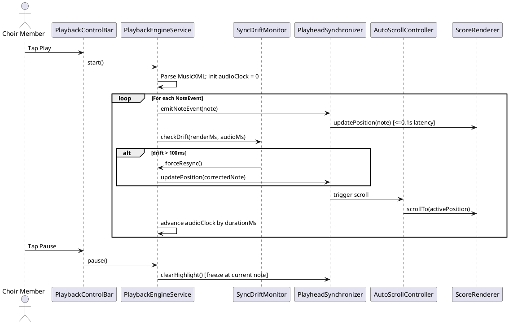

**Transaction 3.1, ERD.**

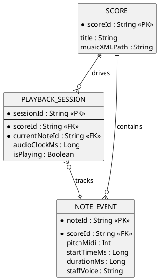

---

### 3.2 Transaction Name: Pause and Resume Tracking

**User Interface Design.**

The Pause and Resume interaction is handled within the same Interactive Practice Screen. Tapping Pause freezes the playhead highlight on the current note and toggles the Play button to a Resume state. The score remains static. Tapping anywhere on a measure while paused seeks the playhead to that position. On Resume, playback and highlighting continue from the frozen or seeked position while minimizing noticeable visual discontinuities during playback resumption.

**Front-end component(s):**

- **Component Name:** PlaybackControlBar (Pause/Resume State)
  - **Description and purpose:** Manages the toggle between Play, Paused, and Resumed states. Swaps the Play icon for a Resume icon when paused, providing clear visual feedback on the current playback status. Dispatches pause and resume commands to the PlaybackEngineService.
  - **Component type or format:** Jetpack Compose Stateful Component; maintains a local isPlaying boolean that drives the icon swap.

- **Component Name:** FrozenPlayheadIndicator
  - **Description and purpose:** When playback is paused, renders a static, outlined version of the playhead highlight on the current note to show the user exactly where the score is suspended. Visually distinguishes the paused state from the active, animated highlight.
  - **Component type or format:** Conditional Jetpack Compose Canvas DrawScope overlay within the PlayheadSynchronizer component; switches from an animated fill to a static outlined border on pause.

- **Component Name:** SeekTapHandler
  - **Description and purpose:** Detects tap gestures on the score view while playback is paused and forwards the tapped screen coordinates to the back-end SeekPositionMapper so the playhead can jump to the corresponding measure.
  - **Component type or format:** Jetpack Compose Modifier.pointerInput (Clickable) on the ScoreRenderer; active only when playback is paused.

**Back-end component(s):**

- **Component Name:** PlaybackEngineService (Pause/Resume Handler)
  - **Description and purpose:** Receives pause and resume commands from the UI. On pause, freezes the internal audio clock and stores the current position in pausedAtMs. On resume, restarts the clock from the preserved position and resumes note-event dispatch.
  - **Component type or format:** Extension of the existing PlaybackEngineService Android Service; adds pause() and resume() methods that suspend and restart the Handler/Runnable timing loop.

- **Component Name:** SeekPositionMapper
  - **Description and purpose:** Translates screen tap coordinates (x, y) into the corresponding MusicXML start timestamp. Uses a MeasureLayoutMap generated at score render time to map a tapped pixel position to the correct NoteEvent, enabling the user to jump to any measure while paused.
  - **Component type or format:** Kotlin utility class; consumes a Map\<Int, Rect\> of measure bounding boxes and returns a startTimeMs value that is passed to PlaybackEngineService.seekTo().

**Object-Oriented Components:**

- Class Diagram
- Sequence Diagram

**Data Design**

- ERD or schema

**Transaction 3.2, Class Diagram.**

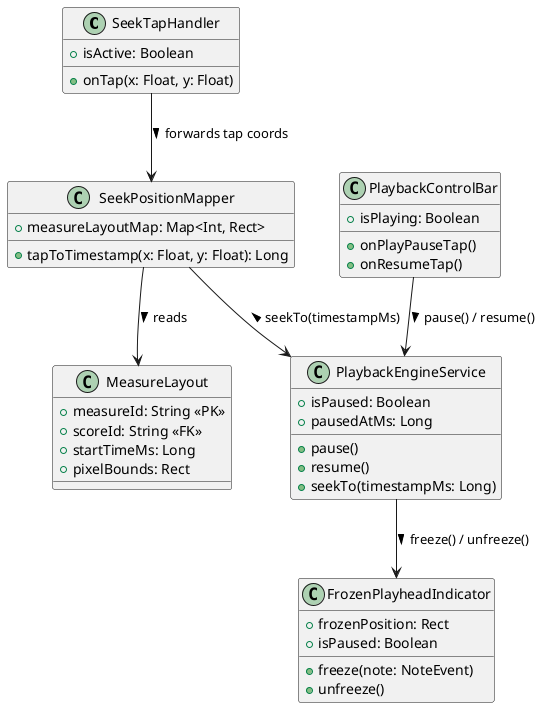

**Transaction 3.2, Sequence Diagram.**

**Transaction 3.2, ERD.**

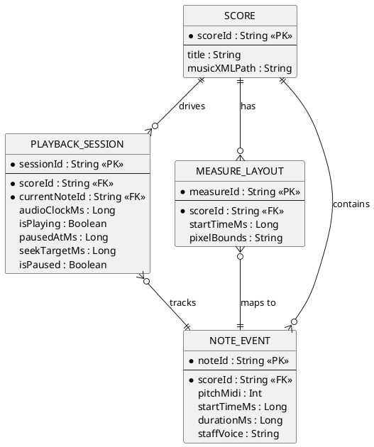

---

## Module 4.

### 4.1 Transaction Name: Sight-Reading Training

**User Interface Design.**

**Front-end component(s)**

- **Component Name:** PracticeModePicker
  - **Description and purpose:** Allows the user to choose between "Listening Mode" (playback only) or "Test Pitch Mode" (activates the microphone for frequency tracking). Captures the user's selection and updates the ViewModel state to route the application to the corresponding practice flow.
  - **Component type or format:** Jetpack Compose Modal/View (Kotlin)

- **Component Name:** PitchDetectionEngine
  - **Description and purpose:** Analyzes the continuous raw audio stream from the device microphone using the TarsosDSP library (YIN algorithm). It extracts the fundamental vocal frequency (Hz) in real-time and continuously emits this numeric data to the UI layer for visual comparison against the target note, targeting a response latency of approximately 0.5 seconds or lower during active pitch tracking.
  - **Component type or format:** Kotlin Native Audio Utility (TarsosDSP)

- **Component Name:** VisualFeedbackRenderer
  - **Description and purpose:** Receives the active Hz data from the Pitch Detection Engine and calculates the deviation in cents against the MusicXML target note. It immediately updates the UI state to render the appropriate visual feedback (e.g., Green for ≤ ±10 cents, Red for > ±10 cents).
  - **Component type or format:** Jetpack Compose UI Modifier / StateFlow (Kotlin)

**Back-end component(s)**

- **Component Name:** SessionMetricsController
  - **Description and purpose:** Receives the final aggregated practice session payload (overall accuracy percentage, elapsed duration, and an array of flagged missed notes) once the user pauses or completes a song, persisting the historical data to the database for progress tracking.
  - **Component type or format:** FastAPI Router Endpoint (POST /api/session/save)

**Object-Oriented Components**

- Class Diagram
- Sequence Diagram

**Data Design**

- ERD or schema

**Transaction 4.1, Class Diagram.**

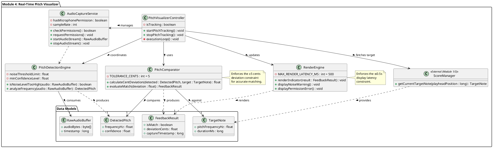

**Transaction 4.1, Sequence Diagram:**

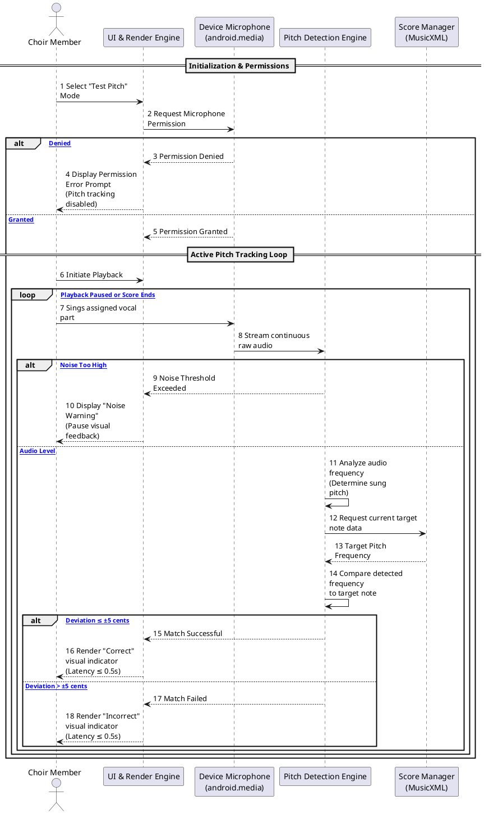

**Transaction 4.1, ERD.**

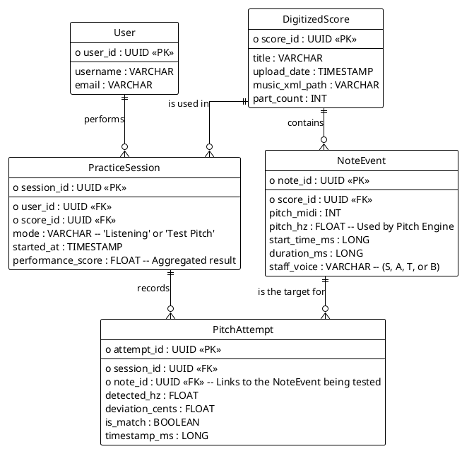
