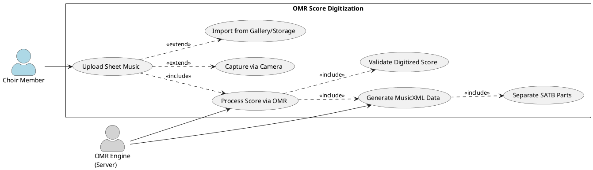
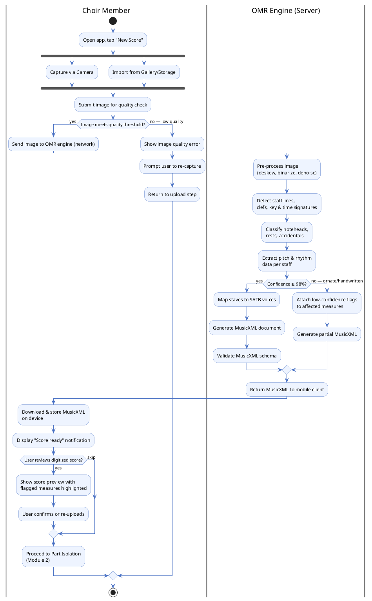
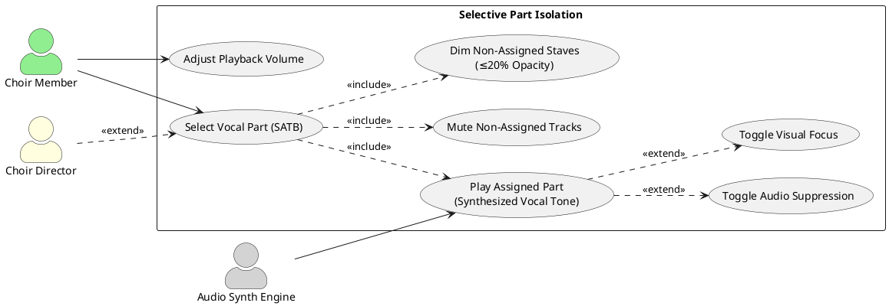
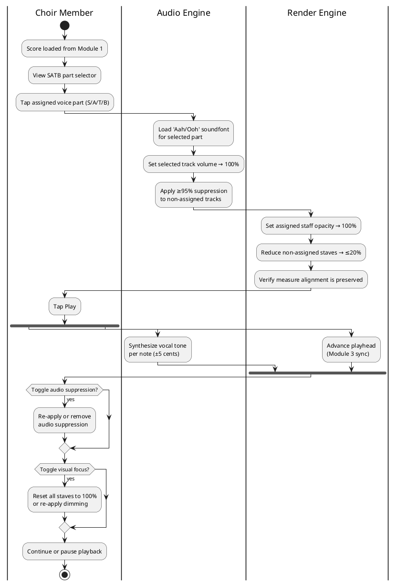
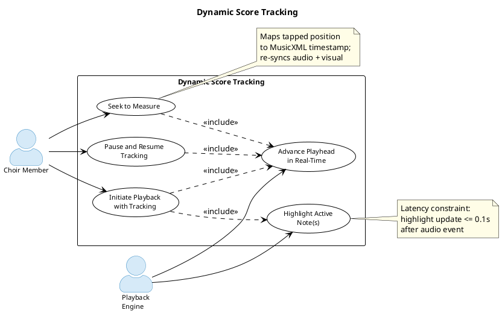
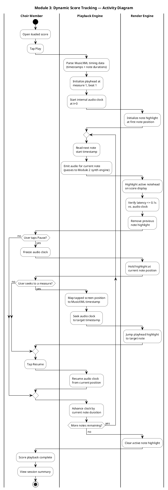
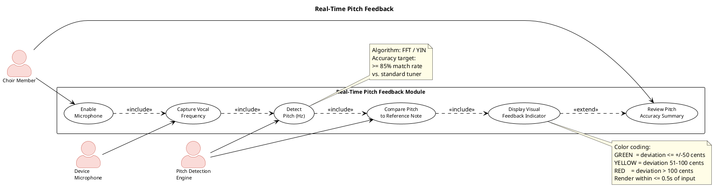
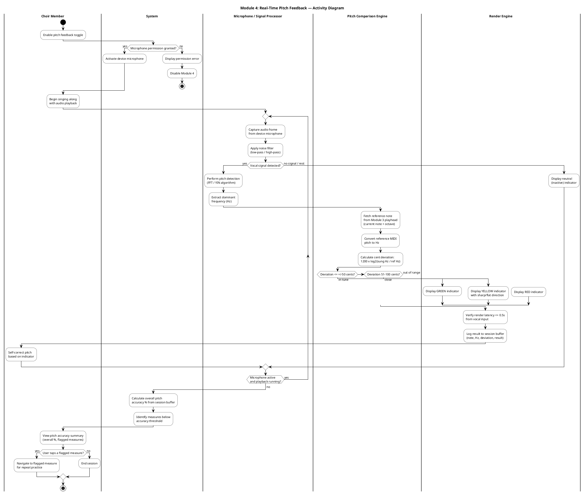

# Software Requirements Specifications
## for VoxSight

**Document Version:** 0.1
**Published Date:** 20 April 2026

---

**CEBU INSTITUTE OF TECHNOLOGY UNIVERSITY**
**College of Computer Studies**

---

## Change History

| Name | Date | Version |
|------|------|---------|
| VoxSight Initial Software Requirements Specification | 04/20/2026 | 0.1 |

---

## Table of Contents

1. [Introduction](#1-introduction)
   - 1.1 [Purpose](#11-purpose)
   - 1.2 [Scope](#12-scope)
   - 1.3 [Definitions, Acronyms and Abbreviations](#13-definitions-acronyms-and-abbreviations)
   - 1.4 [References](#14-references)
2. [Overall Description](#2-overall-description)
   - 2.1 [Product Perspective](#21-product-perspective)
   - 2.2 [User Characteristics](#22-user-characteristics)
   - 2.3 [Constraints](#23-constraints)
   - 2.4 [Assumptions and Dependencies](#24-assumptions-and-dependencies)
3. [Specific Requirements](#3-specific-requirements)
   - 3.1 [External Interface Requirements](#31-external-interface-requirements)
     - 3.1.1 [Hardware Interfaces](#311-hardware-interfaces)
     - 3.1.2 [Software Interfaces](#312-software-interfaces)
     - 3.1.3 [Communications Interfaces](#313-communications-interfaces)
   - 3.2 [Functional Requirements](#32-functional-requirements)
     - [Module 1 — Controlled OMR Digitization](#module-1--controlled-omr-digitization)
     - [Module 2 — Audio-Visual Selective Focus](#module-2--audio-visual-selective-focus)
     - [Module 3 — Sight-Reading Training: Dynamic Score Tracking](#module-3--sight-reading-training-dynamic-score-tracking)
     - [Module 4 — Sight-Reading Training: Real-Time Pitch Feedback](#module-4--sight-reading-training-real-time-pitch-feedback)
   - 3.3 [Non-Functional Requirements](#33-non-functional-requirements)
     - [Performance](#performance)
     - [Security](#security)
     - [Reliability](#reliability)

---

## 1. Introduction

### 1.1 Purpose

The purpose of this document is to provide a detailed description of the **VoxSight** system, a mobile application designed to improve independent sight-reading practice efficiency and reduce rehearsal preparation difficulty for amateur choir members. This document serves as a reference for developers, project managers, and stakeholders to ensure alignment with the functional and non-functional requirements.

---

### 1.2 Scope

VoxSight is a mobile application targeting the **Android platform**. The system enables amateur choir members to independently practice their vocal parts on custom sheet music. The system supports standard choral sheet music images (JPEG/PNG/PDF) and four-part SATB voice structures. The system improves independent choir rehearsal preparation through four core modules:

1. Controlled OMR Digitization
2. Audio-Visual Selective Focus
3. Dynamic Score Tracking
4. Real-Time Pitch Feedback

---

### 1.3 Definitions, Acronyms and Abbreviations

| Term | Definition |
|------|------------|
| **MIDI** *(Musical Instrument Digital Interface)* | A technical standard and digital language that allows computers, software, and musical instruments to communicate and generate sound (e.g., the underlying code instructions that tell an app to play a specific pitch for a certain duration). |
| **OMR** *(Optical Music Recognition)* | A technology that scans physical sheet music and converts it into a digital format that computers can read, edit, and play back (e.g., using an app camera feature to take a picture of a printed choir score and converting it into playable audio). |
| **SATB** *(Soprano, Alto, Tenor, Bass)* | The standard four-part vocal arrangement used in choral music, organized from the highest to the lowest pitch. |
| **Soprano (S)** | The highest vocal range, typically sung by females, which usually carries the main melody. |
| **Alto (A)** | The lower female vocal range that provides harmony directly below the soprano. |
| **Tenor (T)** | The higher male vocal range that provides mid-level harmony and support. |
| **Bass (B)** | The lowest male vocal range that provides the foundational depth of the choir's harmony. |
| **MusicXML** | A digital file format used for representing musical notation in a structured, machine-readable form. |
| **Pitch Detection** | The process of identifying the fundamental frequency of a sound signal (e.g., a sung note). |
| **Frequency (Hz)** | The number of sound wave cycles per second, which determines the perceived pitch of a note. |
| **Latency** | The delay between an input (e.g., singing) and the system's response (e.g., visual feedback). |
| **Cents** *(Pitch Measurement)* | A unit used to measure small pitch differences; 100 cents equals one semitone. |
| **Sight-Reading** | The ability to read and perform music from notation without prior practice. |
| **Score Tracking** | The synchronization of visual note highlighting with audio playback in real time. |
| **Selective Focus** *(Audio-Visual)* | A system feature that prioritizes a selected vocal part by significantly suppressing non-assigned audio tracks and dimming non-relevant notation to reduce auditory and visual cognitive load during practice. |
| **Pitch Feedback** | Real-time visual or auditory indication of whether a sung note matches the expected pitch. |
| **Vocal Synthesis** | The artificial generation of human-like singing tones using digital sound processing. |

---

### 1.4 References

This SRS is based on the following documents and sources:

- VoxSight Project Proposal, Team 2526-sem2-it332-51
- IEEE Std 830-1998 Documentation
- MusicXML Documentation
- Android Developer Documentation (android.media API reference)

---

## 2. Overall Description

### 2.1 Product Perspective

VoxSight is a **mobile-first sight-reading practice application** designed to support independent rehearsal preparation for amateur choir members. The system follows a **client-server architecture** in which uploaded sheet music images are processed through a cloud-based Optical Music Recognition (OMR) engine that converts physical scores into MusicXML data. The mobile client manages:

- Score rendering
- Selective playback
- Synchronized visual tracking
- Real-time pitch feedback during user practice sessions

---

### 2.2 User Characteristics

**Primary Users:** Amateur choir members, particularly those without prior instrumental training, from community, church, or collegiate ensembles.

**Secondary Users:** Choir directors who direct members to use the application for independent preparation.

---

### 2.3 Constraints

- **OMR Accuracy:** Dependent on image quality, lighting conditions, score complexity, and notation clarity. Ornate or handwritten scores may reduce recognition reliability.
- **Vocal Synthesis Fidelity:** Will approximate human timbre but not replicate full live expressiveness.
- **Pitch Detection:** Performs optimally in quiet environments and may be affected by background noise or microphone quality.

---

### 2.4 Assumptions and Dependencies

The primary dependency is on **consistent, reliable network access** for the Optical Music Recognition (OMR) engine to process and return the MusicXML data. It is assumed that users will upload **clear, high-contrast, and legible sheet music images** (JPEG/PNG) for optimal OMR performance.

---

## 3. Specific Requirements

### 3.1 External Interface Requirements

#### 3.1.1 Hardware Interfaces

The system requires access to compatible Android device hardware components including:

- **Device Microphone** — for Real-Time Pitch Feedback
- **Camera** — for OMR image capture
- **Internal Storage/Gallery** — for uploading existing sheet music images

#### 3.1.2 Software Interfaces

The system interfaces with the **Android OS** and utilizes the **MusicXML** data format for digital score representation. External software interfaces include the integrated Optical Music Recognition (OMR) processing engine and vocal synthesizer soundfonts.

#### 3.1.3 Communications Interfaces

A stable **Internet connection** (Wi-Fi or cellular data) is required for cloud-based OMR image processing and MusicXML retrieval — to upload sheet music images to the OMR engine and download the resulting digital score data.

---

### 3.2 Functional Requirements

---

#### Module 1 — Controlled OMR Digitization

Handles user upload (photo/image) of sheet music, processes the physical score into playable MusicXML data, and identifies/separates the distinct SATB parts to reduce manual score interpretation effort during independent practice.

---

##### Use Case Diagram

---

##### Use Case: Upload Sheet Music

| Field | Details |
|-------|---------|
| **Actors** | Primary: Choir Member |
| **Description** | The user provides a sheet music image (JPEG/PNG/PDF) to the system either by capturing a photo with the device camera or importing an existing file from local storage/gallery. |
| **Preconditions** | App is open; internet connection is available; user has sheet music accessible. |
| **Postconditions** | Image is validated and submitted to the OMR engine for processing. |
| **Main Flow** | 1. User opens the application and navigates to "New Score." 2. System displays two options: "Take Photo" and "Import from Device." 3. User selects preferred input method. 4. System accesses camera or file system accordingly. 5. User captures/selects the sheet music image. 6. System performs basic image quality validation (resolution, clarity check). 7. System submits the validated image to the OMR engine over the network. |
| **Alt / Exception** | **A1** – Image fails quality check: System warns user and prompts recapture. **E1** – No internet connection: System displays offline error; upload is blocked. **E2** – Unsupported file format: System rejects the file and notifies the user. |

---

##### Use Case: Process Score via OMR Engine

| Field | Details |
|-------|---------|
| **Actors** | Secondary: OMR Engine (server-side) |
| **Description** | The OMR engine receives the uploaded image and performs optical recognition to extract musical semantics — pitches, rhythms, note durations, and structural elements. |
| **Preconditions** | Image has been successfully uploaded to the server. Network connection is active. |
| **Postconditions** | Raw musical data is extracted and ready for MusicXML generation. Target processing time is ≤10 seconds per standard sheet music page under stable network conditions. |
| **Main Flow** | 1. OMR engine receives image payload from the mobile client. 2. Engine prepares the uploaded image for optical recognition processing. 3. Engine identifies staff lines, clefs, key/time signatures. 4. Engine detects and classifies noteheads, rests, and accidentals per measure. 5. Engine extracts rhythmic and pitch data for all staves. 6. Engine returns structured musical data to the MusicXML generator. |
| **Alt / Exception** | **A1** – Low-clarity image (handwritten/ornate): Engine returns partial data with confidence flags; user is warned of potential errors. **E1** – Processing timeout (>10s): System notifies user; user may retry with a clearer image. |

---

##### Use Case: Generate MusicXML & Separate SATB Parts

| Field | Details |
|-------|---------|
| **Actors** | Secondary: OMR Engine; Primary: Choir Member (receives result) |
| **Description** | The system converts extracted musical data into the MusicXML standard format and structurally separates the four SATB parts into individually addressable tracks. |
| **Preconditions** | OMR processing has completed successfully under the controlled input assumption that uploaded sheet music is a standardized, high-contrast digital print without handwritten markings or severe image skew. |
| **Postconditions** | A valid MusicXML file is stored on the device with four independently accessible SATB tracks. Score is available for playback modules. |
| **Main Flow** | 1. System receives raw musical data from the OMR engine. 2. System maps each detected staff to an SATB voice type (S/A/T/B). 3. System generates a MusicXML document with separate part elements per voice. 4. System validates the generated MusicXML against the standard schema. 5. System downloads and stores MusicXML on the device. 6. System notifies the user that the score is ready. 7. User can proceed to Module 2 (Selective Focus) or Module 3 (Dynamic Score Tracking). |
| **Alt / Exception** | **A1** – Fewer than 4 staves detected: System flags ambiguous parts; user may manually assign voices. **E1** – MusicXML validation fails: System logs error and prompts user to re-upload. |

---

##### Activity Diagram

> *Figure 1: The Digitize Score interface handling user uploads, image processing states, and local MusicXML storage.*

---

#### Module 2 — Audio-Visual Selective Focus

Plays the user's assigned vocal part using synthesized human "Aahs/Oohs" soundfonts while suppressing non-assigned parts and visually dimming unrelated staves to reduce auditory and visual distraction during rehearsal practice. The system maintains the selected vocal line at **full opacity** while reducing non-assigned SATB staves to **≤20% opacity**.

---

##### Use Case Diagram

---

##### Use Case: Select Voice Part and Apply Focus

| Field | Details |
|-------|---------|
| **Actors** | Primary: Choir Member; Secondary: Choir Director (indirect via instruction) |
| **Description** | The user selects their assigned voice type (Soprano, Alto, Tenor, or Bass) from the digitized score. The system immediately applies audio and visual focus based on the selection. |
| **Preconditions** | Module 1 has completed successfully; MusicXML with 4 SATB tracks is loaded on the device. |
| **Postconditions** | Selected part is highlighted at 100% opacity; other parts are dimmed to ≤20% opacity; non-assigned audio tracks are significantly suppressed to minimize auditory interference. |
| **Main Flow** | 1. System displays the digitized score with SATB part selector (S / A / T / B buttons). 2. User taps their assigned voice part. 3. System highlights the selected staff at 100% opacity. 4. System reduces opacity of the three unassigned staves to ≤20%. 5. System routes audio synthesis to the selected part's track only. 6. System applies significant audio attenuation to non-assigned tracks. 7. Score remains spatially intact with measure alignment preserved. |
| **Alt / Exception** | **A1** – User changes part mid-session: System re-applies audio and visual focus to new selection immediately. **E1** – Score has fewer than 4 staves detected: System applies focus to available parts only and flags missing staves. |

---

##### Use Case: Play Assigned Part (Synthesized Vocal Tone)

| Field | Details |
|-------|---------|
| **Actors** | Primary: Choir Member; Secondary: Audio Synthesis Engine |
| **Description** | The system synthesizes the assigned vocal part using human 'Aahs/Oohs' soundfonts mapped to the MusicXML pitch and duration data. Reference tones should approximate standard musical pitch within **±10 cents** deviation under optimal playback conditions. |
| **Preconditions** | A vocal part has been selected (UC-2.1 complete); device audio is active. |
| **Postconditions** | Selected part is audible using synthesized human-vowel tones; non-assigned tracks are significantly attenuated to near-silent levels; playback is synchronized with Dynamic Score Tracking (Module 3). |
| **Main Flow** | 1. User taps the Play button. 2. System reads note pitch and duration data from MusicXML for the selected part. 3. Audio synthesis engine maps pitches to 'Aah/Ooh' soundfont samples. 4. System triggers sample playback with correct pitch frequency (approximately ±10 cents under standard playback conditions). 5. System simultaneously suppresses non-assigned tracks to near-silent levels. 6. Playback continues measure by measure until user pauses or score ends. |
| **Alt / Exception** | **A1** – User pauses playback: System halts audio and visual tracking at current position. **E1** – Soundfont file unavailable: System falls back to MIDI tone with notification to user. |

---

##### Use Case: Toggle Audio Suppression / Visual Focus

| Field | Details |
|-------|---------|
| **Actors** | Primary: Choir Member |
| **Description** | The user can manually toggle audio suppression and visual opacity reduction on/off to switch between isolated practice mode and full-score review mode at any time. |
| **Preconditions** | A vocal part is selected and playback is active or paused. |
| **Postconditions** | Audio suppression and/or visual dimming state is toggled. All staves return to 100% opacity in full-view mode. |
| **Main Flow** | 1. User taps "Audio Mute" toggle or "Visual Focus" toggle. 2. System reads current toggle state. 3. If disabling: System restores all tracks to equal volume and all staves to 100% opacity. 4. If enabling: System re-applies significant audio suppression and ≤20% visual dimming to non-assigned parts. 5. System updates UI indicators to reflect current mode. |
| **Alt / Exception** | **A1** – Toggle triggered during active playback: Transition is applied seamlessly without interrupting playback. |

---

##### Activity Diagram

> *Figure 2: The primary Interactive Practice Screen demonstrating Audio-Visual Selective Focus (Module 2). Note: This unified screen also houses the UI elements for Dynamic Score Tracking (Module 3) and Real-Time Pitch Feedback (Module 4).*

---

#### Module 3 — Sight-Reading Training: Dynamic Score Tracking

Generates a synchronized visual playhead that highlights active musical notes in real-time to assist users in maintaining timing and score position during sight-reading practice.

---

##### Use Case Diagram

---

##### Use Case: Initiate Playback with Tracking

| Field | Details |
|-------|---------|
| **Actors** | Primary: Choir Member; Secondary: Playback Engine |
| **Description** | User initiates playback and the system synchronizes a visual playhead against the MusicXML timing data, highlighting the active note(s) in real-time as audio plays. |
| **Preconditions** | Digitized score loaded; vocal part selected (Module 2); audio engine initialized. |
| **Postconditions** | Active note(s) are highlighted within ≤0.1s of the corresponding audio event. Score scrolls automatically to keep active measures visible. |
| **Main Flow** | 1. User taps Play. 2. System parses MusicXML timestamp and duration data for all notes. 3. Playback engine starts internal audio clock at t=0. 4. At each note's start timestamp, the render engine highlights the corresponding notehead on screen. 5. System synchronizes visual note highlighting with audio playback while maintaining a target latency of ≤0.1 seconds. 6. Previous note highlight is removed as the next note begins. 7. Score view auto-scrolls to keep the active measure centered on screen. |
| **Alt / Exception** | **E1** – Synchronization drift >0.1s: System re-syncs playhead to audio clock position. **A1** – User seeks to a different measure: Playhead jumps to target position; audio and visual re-sync. |

---

##### Activity Diagram

> **Wireframe Note:** The Dynamic Score Tracking playhead is rendered directly on the primary practice interface. Please refer to **Figure 2 in Module 2** to view the visual synchronization of the playhead against the sheet music.

---

#### Module 4 — Sight-Reading Training: Real-Time Pitch Feedback

Captures the user's sung pitch via the microphone and displays an immediate visual indicator (e.g., color coding) against the digitized reference notes.

---

##### Use Case Diagram

---

##### Visual Feedback Color Coding

| Indicator | Deviation | Meaning |
|-----------|-----------|---------|
| 🟢 **GREEN** | ≤ ±50 cents | In-tune |
| 🟡 **YELLOW** | 51–100 cents | Close — displays sharp/flat direction |
| 🔴 **RED** | > 100 cents | Out of range |

> Render within ≤0.5s of vocal input. Algorithm: FFT / YIN. Accuracy target: ≥85% match rate vs. standard tuner.

---

##### Use Case: Real-Time Pitch Feedback

| Field | Details |
|-------|---------|
| **Actors** | **Primary:** Choir Member. **Secondary:** Pitch Detection Engine / Device Microphone. |
| **Description** | The system utilizes the device microphone to capture the user's sung audio in real-time. It processes the vocal frequency and provides an immediate visual indicator (such as correct/incorrect color coding) on the screen to show whether the sung pitch matches the target note from the digitized score. |
| **Preconditions** | The application is open, a digitized score is loaded, and a vocal part is selected. The user has granted the application permission to access the device microphone. The user is in a relatively quiet environment for optimal detection. |
| **Postconditions** | The user's sung pitch is visually evaluated against the reference note on the screen with a display delay of ≤0.5 seconds. The system targets a pitch match accuracy of approximately ≥85% under quiet environmental conditions. |
| **Main Flow** | The user selects a digitized score from their library. The system prompts the user to select a practice mode: **"Listen"** (Study) or **"Test Pitch"** (Practice Feedback). **If "Listen" is selected:** The system disables the Pitch Detection Engine and loads the Interactive Practice Screen. The user listens to the synthesized track with dynamic score tracking, but no visual pitch indicators are rendered. **If "Test Pitch" is selected:** The system verifies microphone permissions and activates the device microphone *before* loading the Interactive Practice Screen. The user initiates playback. The device microphone continuously captures the raw audio input. The Pitch Detection Engine analyzes the audio frequency to determine the sung pitch. The system compares the detected vocal frequency to the pitch data of the current target note stored in the MusicXML file. The system renders a visual indicator (e.g., color-coded note highlights) reflecting pitch accuracy within the required ≤0.5 seconds latency. This process loops seamlessly until the user pauses playback or the score ends. |
| **Alt / Exception** | **E1 – Background Noise Interference:** If environmental noise obscures the vocal input to the point that pitch detection falls below the optimal threshold, the system displays a "Noise Warning" and pauses visual feedback. **E2 – Microphone Permission Denied:** If the system cannot access the microphone, it displays an error prompt directing the user to device settings; pitch tracking remains disabled. **A1 – Pitch Deviation:** If the user's sung pitch deviates from the reference tone beyond the acceptable ±10 cents threshold, the system immediately updates the visual indicator to reflect an incorrect pitch. |

---

##### Activity Diagram

> *Figure 3: The pre-selection "Gatekeeper" modal prompting the user for their practice mode before initializing the microphone hardware, preventing race conditions.*

> **Wireframe Note:** The live green/yellow/red pitch feedback indicator is rendered directly on the active sheet music. Please refer to **Figure 2 in Module 2** to view this real-time indicator.

> *Figure 4: The post-session Practice Summary Screen generated by the Module 4 session buffer, displaying overall accuracy and specific flagged measures for review.*

---

### 3.3 Non-Functional Requirements

#### Performance

The system must meet the following performance metrics:

| Metric | Requirement |
|--------|-------------|
| **OMR Processing Speed** | ≤10 seconds per page |
| **OMR Separation Accuracy** | ~80–85% structural track separation accuracy under controlled input conditions using standardized high-contrast digital sheet music inputs |
| **Audio-Visual Synchronization Latency** | ≤0.1 seconds note highlight latency |
| **Pitch Feedback Latency** | ≤0.5 seconds visual feedback display delay |
| **Pitch Detection Accuracy** | ~≥85% pitch match accuracy against reference notes under quiet environmental conditions |
| **Auditory Suppression** | Significant attenuation of non-assigned background tracks to minimize auditory interference during isolated vocal practice |

---

#### Security

The system must ensure the security of user-uploaded score images and recorded microphone input data, treating them as **private user data**:

- Data in transit shall be encrypted using **TLS 1.3**.
- Local storage of MusicXML files shall utilize **Android Scoped Storage**.

---

#### Reliability

The application shall maintain stable playback, synchronized score tracking, and pitch feedback functionality during active practice sessions under standard Android operating conditions.

- In the event of synchronization drift exceeding the ≤0.1 second threshold, the system shall **automatically re-synchronize** the visual playhead with the active audio clock.
- Pitch reference tones shall maintain an approximate frequency deviation threshold of **±10 cents** under standard playback conditions.

---

*VoxSight Software Requirements Specification — Document Version 0.1 — 20 April 2026*
*Cebu Institute of Technology University — College of Computer Studies*
