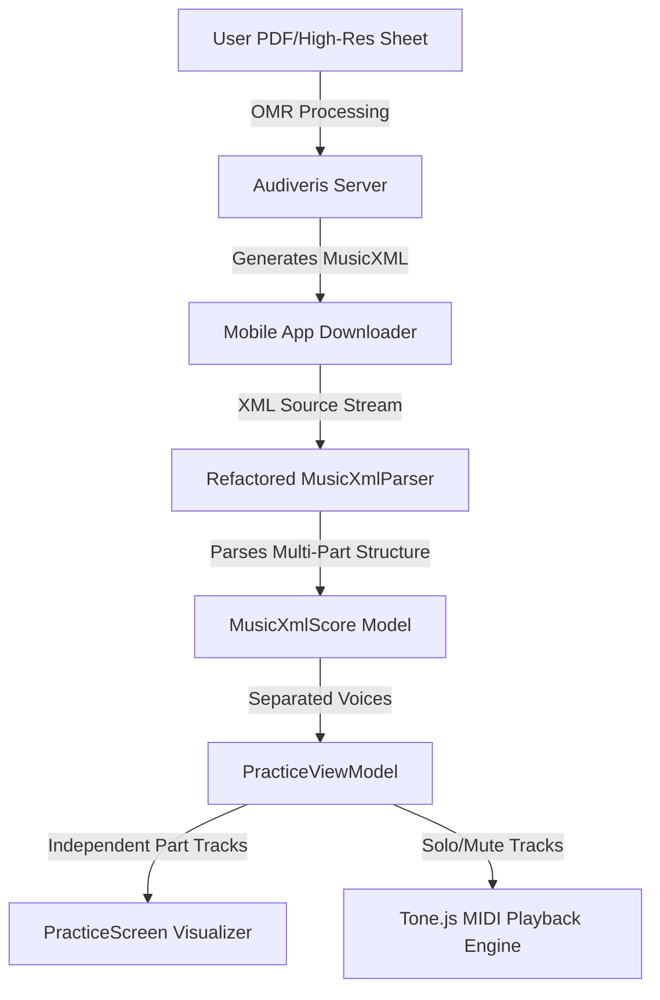

# 🎯 VoxSight OMR & Playback Improvement Plan
This implementation plan outlines the targeted fixes for the OMR (Optical Music Recognition) pipeline, voice isolation (SATB separation), and audio playback issues in **VoxSight**. 

## 1. Problem Diagnosis & Root Causes

### 🚨 Critical Issue: Soprano Voice Merging & 30-Minute Duration
The system currently merges all parts and voices into a single track (Soprano). Instead of dividing notes into parallel voices (Soprano, Alto, Tenor, Bass), the notes are either appended sequentially, which artificially inflates the duration of the song to over 30 minutes, or stacked on top of each other incorrectly, resulting in harmonic chaos.

### 🔍 Technical Breakdown

* **Voice Merging in `MusicXmlParser.kt`**: 
  The current Kotlin parser reads the `<note>` elements sequentially without organizing them by `<part-list>` or `<voice>` tags. If the parser treats every note it encounters as a linear sequence on a single timeline, the total duration becomes the sum of all parts combined, rather than concurrent parts playing in parallel.
* **Lack of Voice Isolation**:
  The system has no backend or frontend logic to partition the incoming MusicXML into distinct tracks. As a result, the playback engine plays everything on a single instrument channel, making it impossible to isolate, mute, or solo a specific voice part (S/A/T/B).
* **Rhythmic and Pitch Inaccuracy**:
  The parser fails to handle attributes like `<divisions>`, `<alter>` (sharps/flats), and `<rest>` elements properly. The lack of support for dotted notes, ties, and rests leads to broken rhythms and incorrect pitches.
* **Low-Quality Camera Inputs**:
  When users upload a low-resolution photo taken with a phone camera, Audiveris fails to detect the staff lines accurately. This is why the output of the OMR scanner feels "unfriendly" and "broken," while standard PDFs of high quality convert with much higher fidelity.

---

## 2. Improved Architecture

The refactored OMR and Playback pipeline will treat the MusicXML as a **Multi-Part, Multi-Voice score**. Notes will be parsed, visualised, and played back as concurrent tracks rather than a single merged stream.



---

## 3. Phased Implementation Roadmap

Given the urgent **deadline of tomorrow**, the plan is split into **Core Refactoring** (must be completed immediately to fix compilation, duration, and playback) and **UX Polish & Verification** (to ensure user-friendly feedback).

### 📋 Phase 1: MusicXML Part & Voice Parser Refactor
**Objective:** Rewrite `MusicXmlParser.kt` to parse parts, measures, voices, and attributes correctly instead of flattening all notes.

* **Introduce `Part` and `Voice` data models:**
  ```kotlin
  data class MusicXmlScore(
      val title: String,
      val parts: List<MusicXmlPart>
  )

  data class MusicXmlPart(
      val id: String,
      val name: String,
      val measures: List<MusicXmlMeasure>
  )

  data class MusicXmlMeasure(
      val number: Int,
      val notes: List<MusicXmlNote>
  )

  data class MusicXmlNote(
      val step: String,
      val octave: Int,
      val alter: Int, // Support sharps and flats
      val duration: Int,
      val voice: Int,
      val isRest: Boolean,
      val type: String, // e.g., "quarter", "half", "whole"
      val isDotted: Boolean
  )
  ```
* **Correct Playback Timeline & Duration Calculation:**
  Instead of summing all note durations, the total duration of the song is determined by the **longest individual part** (`maxByOrNull { part.totalDuration }`). Notes within each measure are grouped by their `<voice>` to play in parallel.

### 📋 Phase 2: SATB Voice Isolation in ViewModel
**Objective:** Update `PracticeViewModel.kt` to expose separate tracks and support solo/mute options for Soprano, Alto, Tenor, and Bass.

* **Expose Voice State Flows:**
  Provide independent states for active parts to the UI:
  ```kotlin
  val sopranoPart = MutableStateFlow<MusicXmlPart?>(null)
  val altoPart = MutableStateFlow<MusicXmlPart?>(null)
  val tenorPart = MutableStateFlow<MusicXmlPart?>(null)
  val bassPart = MutableStateFlow<MusicXmlPart?>(null)
  ```
* **Track Mute / Solo States:**
  Maintain Boolean flags to determine which tracks should be sent to the audio engine (e.g., `sopranoMuted = true` to isolate Tenor/Bass).

### 📋 Phase 3: Visual Staff Rendering & Multi-Staff Display
**Objective:** Update `PracticeScreen.kt` Canvas renderer to draw separate staves for each voice or highlight notes according to the selected part.

* **Separate Canvas Drawings:**
  Render distinct horizontal staves on the `Canvas` for the different voices if the user chooses a "Multi-Voice" view, or dynamically filter the visible notes to show only the selected voice (S, A, T, or B).
* **Sync the Visual Playhead**:
  Map the current note pointer based on actual beats/divisions elapsed, rather than index-based increments, resolving the visual speed issues during playback.

### 📋 Phase 4: Tone.js Multi-Track Playback Integration
**Objective:** Enhance the WebView MIDI engine (`player_phase1.html` / `player.js`) to support multiple instruments playing in parallel.

* **Multi-Synth Playback:**
  Instantiate multiple `Tone.Synth` or `Tone.PolySynth` voices representing Soprano, Alto, Tenor, and Bass.
* **Parallel Track Scheduling:**
  Load the parsed notes into separate parallel sequences in Tone.js so they play concurrently:
  ```javascript
  const sopranoTrack = new Tone.Part((time, note) => {
      synthSoprano.triggerAttackRelease(note.pitch, note.duration, time);
  }, sopranoNotes).start(0);
  
  const altoTrack = new Tone.Part((time, note) => {
      synthAlto.triggerAttackRelease(note.pitch, note.duration, time);
  }, altoNotes).start(0);
  ```

### 📋 Phase 5: Input Validation & Error Feedback
**Objective:** Prevent users from uploading low-res images that result in broken XML outputs, and supply user-friendly instructions.

* **Camera / File Resolution Checker:**
  In `UploadScoreScreen.kt`, inspect the pixel density and dimensions of any camera image before sending it to the backend.
* **Friendly Warnings:**
  If the resolution is less than 1000px, display a modern warning card: *"This image might result in inaccurate notes. For best results, upload a PDF file or a clearer 300+ DPI photo."*

---

## 4. Timelines & Effort Estimation

| Phase | Core Tasks | Estimated Time | Files Impacted |
|---|---|---|---|
| **Phase 1** | Refactor `MusicXmlParser.kt`, update `MusicXmlScore` models, and handle `<alter>`, `<rest>`, and `<voice>`. | **2.5 Hours** | `MusicXmlParser.kt`, `MusicXmlScore.kt` |
| **Phase 2** | Update `PracticeViewModel.kt` to handle multi-part streams, isolate S/A/T/B state, and handle mute/solo actions. | **1.5 Hours** | `PracticeViewModel.kt` |
| **Phase 3** | Refactor `PracticeScreen.kt` visual rendering to draw multi-voice staves and align playhead with real durations. | **2 Hours** | `PracticeScreen.kt` |
| **Phase 4** | Modify WebView Tone.js backend to support parallel multi-synth tracks and separate channels. | **2 Hours** | `player_phase1.html`, `MidiPlaybackEngine.kt` |
| **Phase 5** | Add pre-flight resolution check and inline user-friendly error UI. | **1 Hour** | `UploadScoreScreen.kt`, `OcrErrorFormatter.kt` |

---

## 5. Risk Matrix & Mitigations

| Identified Risk | Impact | Mitigation Strategy |
|---|---|---|
| **Audiveris merges staves anyway on backend** | 🔴 High | Backend can be configured to keep separate parts, or the parser can split notes based on their `<staff>` and `<voice>` IDs. |
| **Tone.js performance lag on mobile WebView** | 🟡 Medium | Restrict synthesis to simple oscillators (e.g., triangle waves) which run smoothly on mobile devices. |
| **Lack of time before deadline** | 🔴 High | Focus exclusively on **Phases 1, 2, and 4** to fix compilation, duration, and multi-track audio. Visual polish can be simplified to a single-staff highlighter. |

---

> [!NOTE]
> ### 🔗 Quick Links to Files
> * Parse Logic: [MusicXmlParser.kt](file:///c:/Users/LAGAMO/Documents/3rd%20year%202nd%20sem/Capstone/VoxSight/mobile/app/src/main/java/com/cit/kaido/voxsight/ui/screens/practice/MusicXmlParser.kt) (Currently being updated)
> * Practice Screen UI: [PracticeScreen.kt](file:///c:/Users/LAGAMO/Documents/3rd%20year%202nd%20sem/Capstone/VoxSight/mobile/app/src/main/java/com/cit/kaido/voxsight/ui/screens/practice/PracticeScreen.kt)
> * Practice ViewModel: [PracticeViewModel.kt](file:///c:/Users/LAGAMO/Documents/3rd%20year%202nd%20sem/Capstone/VoxSight/mobile/app/src/main/java/com/cit/kaido/voxsight/ui/viewmodel/PracticeViewModel.kt)
